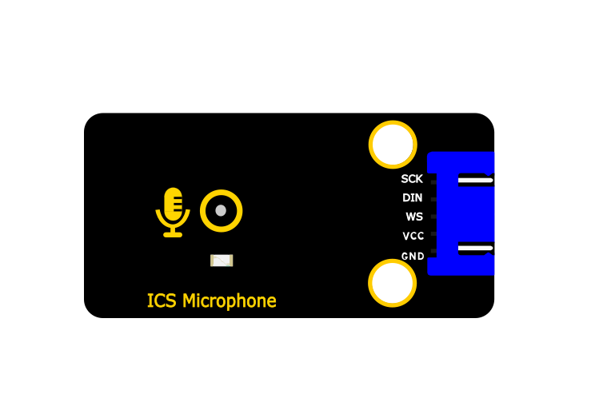
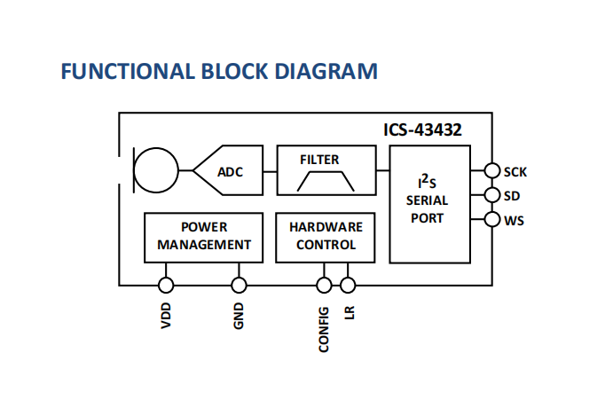
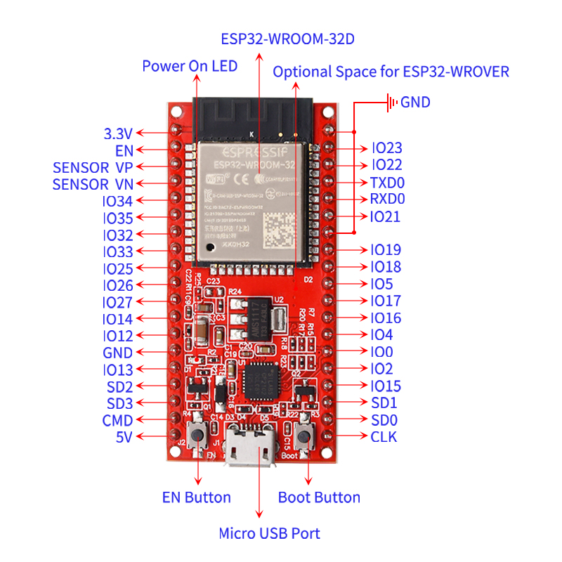
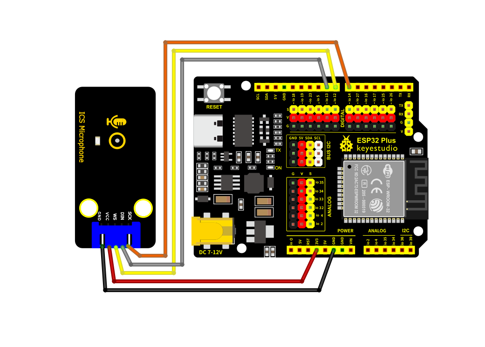
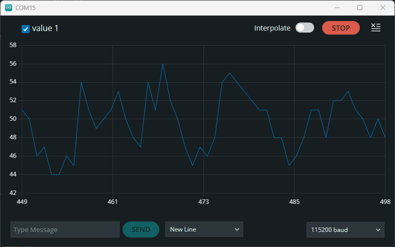
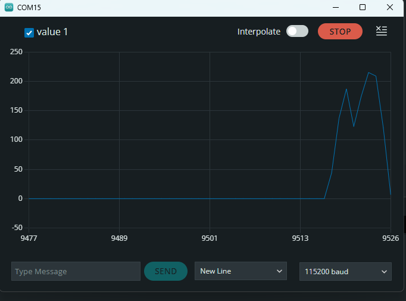
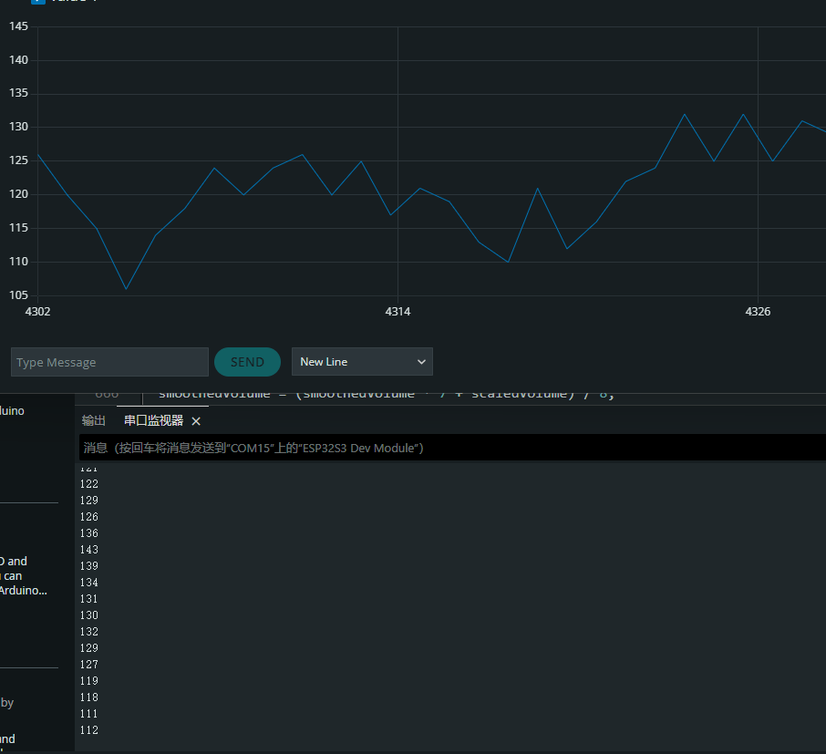

# KE4089 Keyes STEM电子积木 ICS麦克风模块 黑色环保



## 1. 介绍

本模块核心采用ICS-43432数字麦克风芯片，这是一款高性能、低噪声的底部收音孔MEMS麦克风。内置MEMS传感器、Σ-Δ ADC、抗混叠滤波器、电源管理以及符合I2S标准的接口，可直接输出24位数字音频信号。同时，模块自带2个直径为4.8mm的定位孔，便于将模块固定在其他设备。

## 2. 规格参数

- **工作电压**：3.3V - 5V DC
- **接口类型**：I2S数字接口
- **信噪比**：65 dBA
- **灵敏度**：-26 dBFS
- **功耗**：1.5 mA 
- **指向性**：全指向
- **数据格式**：24位I2S
- **灵敏度容差**：±1 dB
- **声学过载点**：116 dB SPL
- **频率响应**：50 HZ - 20 kHZ
- **工作温度**：-40°C 到 +85°C
- **尺寸**：48mm × 24mm × 1.6mm


## 3. 工作原理

**芯片特性**：

- 高精度24位数字I2S接口
- ±1 dB灵敏度容限，适合麦克风阵列应用
- 宽频响应，覆盖语音和音频范围
- 低功耗设计，适合便携设备

**I2S接口时序**：  

I2S总线由3个主要信号组成：  

- **SCK**：位时钟
- **WS**：字选择
- **DIN**：串行音频数据

**功能示意图**：



## 4. 引脚描述

- **G**：电源地
- **V**：电源正极
- **SCK**：位时钟输入
- **DIN**：数据输出
- **WS**：左右声道时钟

## 5. 连接图

**以Keyes ESP32 Core Board开发板为例**：

| 名称 | 数量 |
|------|------|
| Keyes ESP32 Core Board | 1 |
| ICS-43432麦克风模块 | 1 |
| XH-2.54 5P 转杜邦母单头 | 1 |
| microUSB线 | 1 |

| 麦克风模块 | ESP32开发板 |
|------------|-------------|
| V          | 3.3V        |
| G          | GND         |
| SCK        | GPIO14      |
| WS         | GPIO12      |
| DIN        | GPIO13      |




## 6. 环境搭建及测试代码

**环境搭建**

详细指南可参考：[KE0162 Keyes ESP32 Core Board](https://www.keyesrobot.cn/projects/ESP32-Shield/zh-cn/latest/KE0162%20Keyes%20ESP32%20Core%20Board.html)。

**测试代码**

Arduino IDE代码（基于ESP32）：

```cpp
#include "driver/i2s.h"
#include <Arduino.h>

long avgVol = 0;  

void setup() {
  Serial.begin(115200);
  
  // I2S配置
  i2s_config_t config = {
    .mode = (i2s_mode_t)(I2S_MODE_MASTER | I2S_MODE_RX),
    .sample_rate = 44100,
    .bits_per_sample = I2S_BITS_PER_SAMPLE_32BIT,
    .channel_format = I2S_CHANNEL_FMT_ONLY_LEFT,
    .communication_format = I2S_COMM_FORMAT_STAND_I2S,
    .intr_alloc_flags = 0,
    .dma_buf_count = 4,
    .dma_buf_len = 64,
    .use_apll = false
  };

  i2s_pin_config_t pins = {
    .bck_io_num = 14,
    .ws_io_num = 12,
    .data_out_num = I2S_PIN_NO_CHANGE,
    .data_in_num = 13
  };

  i2s_driver_install(I2S_NUM_0, &config, 0, NULL);
  i2s_set_pin(I2S_NUM_0, &pins);
  i2s_start(I2S_NUM_0);
}

void loop() {
  int32_t samples[64];
  size_t bytes_read;
  
  i2s_read(I2S_NUM_0, samples, sizeof(samples), &bytes_read, portMAX_DELAY);
  
  long total = 0;
  for(int i = 0; i < 64; i++) {
    total += abs(samples[i]);
  }
  
  int raw = total / 64;  
  int scaled = raw / 30000;  
  avgVol = (avgVol * 9 + scaled) / 10;  
  int vol = constrain(avgVol, 0, 1000);  
  Serial.println(vol);  
   
  delay(200); 
}

```

## 7. 测试结果

烧录测试代码后，按照接线图连接好线路，上电后打开串口监视器。

正常接收外界声音



对着模块吹气



制造噪音




